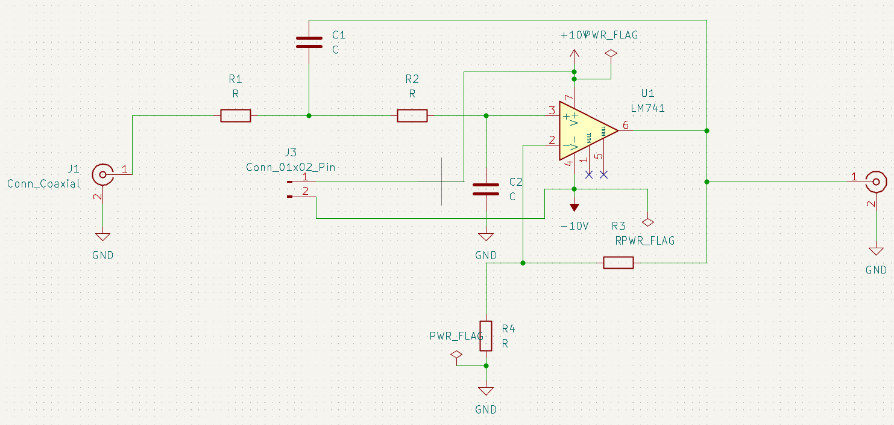

# Second-Order Active Low-Pass Filter (LM741)  

## Overview  

This project implements a **second-order active low-pass filter** using the **LM741 operational amplifier**. The filter is designed in **KiCad** and is suitable for basic signal conditioning and noise filtering applications.  

The filter attenuates frequencies above a specified **cutoff frequency (fc)** while allowing lower-frequency signals to pass with minimal attenuation.  

## Schematic  

  

## PCB Layout  

Here’s a preview of the designed PCB:  

  

The filter circuit is built using a **Sallen-Key topology** and includes:  

- **Op-Amp**: LM741 (U1)  
- **Resistors**: R1, R2, R3, R4  
- **Capacitors**: C1, C2  
- **Input/Output**: J1, J2 (Coaxial connectors), J3 (Pin connector)  
- **Power Supply**: ±10V  

*(Replace component values and results below with your actual design)*

| Component | Value       |
|-----------|-------------|
| R1        | 3.3 kΩ      |
| R2        | 3.3 kΩ      |
| R3, R4    | 10 kΩ       |
| C1        | 10 nF       |
| C2        | 10 nF       |
| Cutoff    | ~4.8 kHz    |  

## Files Included  

📁 **KiCad Project Files**  
- Schematic: `Second_Order_Low_Pass_Filter_Ac.kicad_sch`  
- PDF Schematic: `Second_Order_Low_Pass_Filter_Ac.pdf`  
- PCB Layout: `Second_Order_Low_Pass_Filter_Ac.kicad_pcb`  

📁 **Fabrication Files**  
- **Gerber Files**: Ready for PCB manufacturing.  
- Drill files and fabrication layers included.  

📁 **Bill of Materials (BOM)**  
- Can be generated from KiCad (`Tools` -> `Generate BOM`).  

## How to Use  

1. **View Schematic and PCB**  
   - Open `.kicad_sch` and `.kicad_pcb` files in **KiCad** (v9.0.2 or newer).  

2. **Simulate (Optional)**  
   - Export netlist and simulate in a tool like LTspice or use KiCad’s simulator for basic analysis.  

3. **Fabricate PCB**  
   - Use the included **Gerber files** to manufacture the PCB through a PCB fabrication service.  

4. **Assemble the Circuit**  
   - Solder components as per the schematic and BOM.  
   - Power the board using ±10V.  

5. **Test the Filter**  
   - Apply test signals and verify the cutoff frequency response using an oscilloscope or signal analyzer.  

## Notes  

- The **LM741** is a general-purpose op-amp with limited bandwidth. For high-frequency applications, consider alternatives like TL072 or LM358.  
- This filter is ideal for **audio applications** or low-frequency signal conditioning tasks.  

## License  

GPL 3.0

## Acknowledgments  

Special thanks to the **KiCad community** for making open-source hardware design accessible!  
